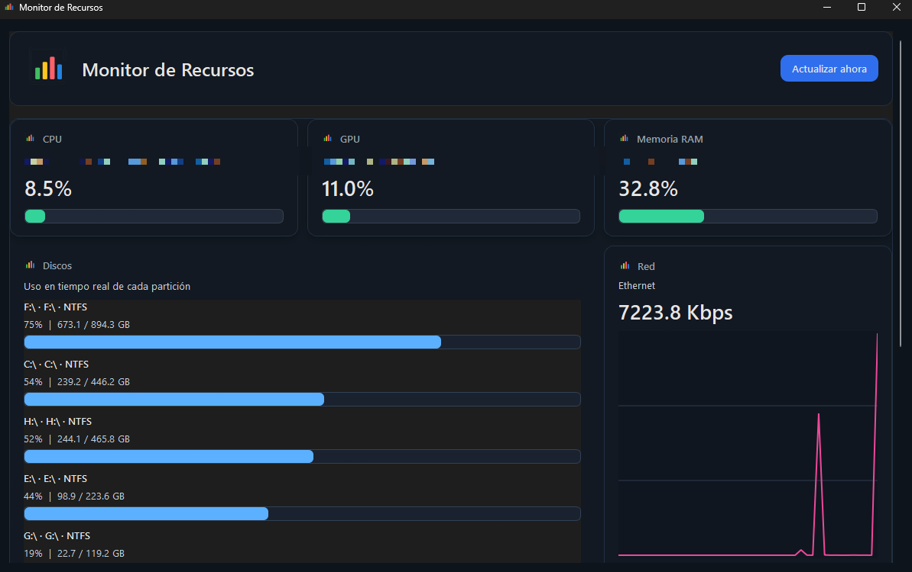

# Monitor de Recursos

Aplicacion de escritorio en Python para monitorear en tiempo real los recursos principales del sistema: CPU, memoria RAM, GPU, discos, red y procesos activos.

## Detalles rapidos

<p align="center">
  
  
  
  
  
  
  
  
  
</p>

## Vista previa



## Que hace

- Muestra uso de CPU, RAM y GPU en tarjetas resumidas.
- Lista los discos montados con su porcentaje de uso.
- Grafica la actividad de red en tiempo real.
- Muestra hasta 50 procesos ordenados por carga.
- Permite finalizar el proceso seleccionado desde la interfaz.
- Guarda eventos en un archivo de log local.
 - Reconoce y muestra GPUs y CPUs múltiples cuando están disponibles (soporte mejorado en Linux).

## Como funciona

El proyecto sigue una estructura simple separada en tres capas:

- `main.py` inicia la aplicacion, configura el estilo, el icono y el logging.
- `controladores/controlador_monitor.py` coordina la actualizacion cada 2 segundos y maneja las acciones de la ventana.
- `modelos/monitor_sistema.py` consulta la informacion real del sistema con `psutil`, usa `nvidia-smi` cuando está disponible y dispone de detectores genéricos en Linux (`lspci`, `glxinfo`). El código ahora reconoce múltiples GPUs y CPUs y normaliza GPUs integradas como "Gráficos integrados".
- `vistas/` contiene la interfaz PySide6 y los paneles visuales.
- `recursos/` guarda estilos, logo, configuracion de logs y la imagen del proyecto.

El flujo es este:

1. `main.py` crea la aplicacion y construye `ControladorMonitor`.
2. El controlador instancia el modelo y la ventana principal.
3. El modelo detecta la GPU disponible por el sistema; si existe `nvidia-smi`, usa sus metricas, y si no, sigue funcionando con una deteccion generica.
4. Cada 2 segundos el controlador pide datos nuevos al modelo.
5. La ventana recibe el resumen y actualiza tarjetas, tablas y graficas.

## Requisitos

- Python 3.11 o superior.
- Soporte multiplataforma: la aplicación es compatible con Linux (detecta múltiples CPUs y GPUs; usa `nvidia-smi` para métricas detalladas en NVIDIA cuando está disponible). Las GPUs integradas se muestran como "Gráficos integrados".
- Dependencias instaladas desde `requirements.txt`.

## Instalacion

```bash
python -m venv .venv
# En Linux / macOS:
source .venv/bin/activate
# En Windows (PowerShell):
# .venv\Scripts\Activate.ps1
pip install -r requirements.txt
```

## Ejecucion

```bash
python main.py
```

Si no hay acceso a `nvidia-smi`, la app no se detiene: muestra la GPU detectada por el sistema y deja las métricas avanzadas en cero cuando no están disponibles. En Linux la detección genérica puede usar `lspci` o `glxinfo` según lo disponible; la app ahora reconoce múltiples GPUs y CPUs.

## Estructura del proyecto

```text
main.py
requirements.txt
controladores/
  controlador_monitor.py
modelos/
  monitor_sistema.py
recursos/
  configuracion_logging.py
  estilos.py
  logo.py
  image.png
vistas/
  componente_tarjeta.py
  panel_discos.py
  panel_procesos.py
  panel_red.py
  tarjeta_informativa.py
  ventana_principal.py
logs/
```

## Notas

- La lista de procesos visibles se limita a 50 para mantener buen rendimiento.
- El panel de discos reutiliza sus filas para evitar recrear widgets en cada refresco.
- Los registros se guardan en `logs/monitor_recursos.log`.
- El proyecto se distribuye bajo licencia MIT.